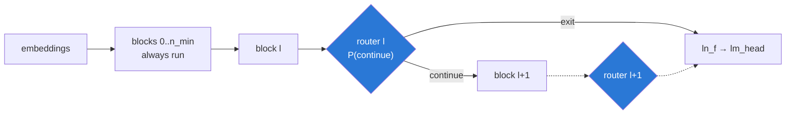

# AdaptiveGPT — dynamic layer skipping for efficient language models

> **Can a GPT reduce computation by dynamically skipping layers for "easy" tokens,
> while keeping language-modelling quality comparable to a dense model?**

Every token in a standard transformer pays for all twelve layers. Most of them do not
need it: by layer six a predictable function word has stopped moving in the residual
stream, and the remaining layers refine it by almost nothing. AdaptiveGPT learns a
per-token **exit** decision — a small router after each layer says *continue* or
*stop*, a stopped token keeps its hidden state and is unembedded from wherever it
stopped, and the batch is compacted down to the survivors so the saving is real
wall-clock rather than a FLOP count on paper.



An exited token is **still part of the context** — later tokens keep attending to its
frozen state — so this is a decision about how much compute a token *receives*, not
about removing it from the sequence.

---

## Why early exit rather than per-layer skipping

The obvious alternative is Mixture-of-Depths: let each layer independently pick a fixed
number of tokens to process. That design needs a top-k over the sequence, and top-k is
not causal — whether token 5 is selected depends on token 900's score. It works under
teacher forcing and is impossible during generation, so it needs a second causal
predictor head, a BCE loss teaching it to imitate the top-k, a calibrated decision
threshold, and a reported train/generate agreement number attached to every result.

An exit decision reads one token's own hidden state and nothing else. It is causal by
construction: **the decision made while generating is the decision made while
training.** No second head, no calibration, no asterisk.
`tests/test_exit.py::test_exit_decision_is_prefix_invariant` pins it.

The price is that the depth is no longer fixed in advance. It is steered by a penalty
and then *measured* — which is why the baselines are matched to the depth the adaptive
arm actually reached.

---

## Results

_Fill in from `results/compare.json`._ Every number below comes from
`scripts/compare.py`, which evaluates all four arms from **one checkpoint** under four
routing rules, so they differ in the routing and in nothing else.

| arm | ppl | avg depth | layer FLOPs | total FLOPs | throughput |
|---|---:|---:|---:|---:|---:|
| Dense (control) | — | 12.0 | 100% | 100% | 1.00× |
| Random skip (depth-matched) | — | — | — | — | — |
| Fixed exit (depth-matched) | — | — | — | — | — |
| **AdaptiveGPT** | — | — | — | — | — |

The two matched baselines are what decide whether the project worked:

- beat **random skip** or the router has only learned to hit a budget;
- beat **fixed exit** or per-token adaptivity buys nothing over simply using a
  shallower model.

**Report two FLOP axes, always.** At d=384 with the GPT-2 vocabulary the output head is
~46% of forward FLOPs and routing cannot touch it, so the total-FLOP saving is capped
at roughly half the layer-FLOP saving. That is a finding about adaptive-compute methods
at small width, not a presentation choice — see `docs/DESIGN_NOTES.md` §2.

---

## Setup

```bash
pip install torch --index-url https://download.pytorch.org/whl/cu128
pip install -r requirements.txt
pip install triton-windows          # Windows only; REQUIRED for torch.compile
```

`triton-windows` is not optional if you intend to quote a speedup. Without
`torch.compile` the bookkeeping around routing can cost more than the skipped layers
save. See `docs/DESIGN_NOTES.md` §1.

## Run

```bash
pytest -q                                     # 74 tests, ~15s on CPU

python -m agpt.data.prepare --dataset wikitext103        # ~117M GPT-2 tokens

# Stage 1 — the language model, dense. This checkpoint is ALSO the dense baseline.
python -m agpt.train --stage dense --run-name s1_dense \
    --max-steps 3600 --dropout 0.1 --eval-steps 40 --compile

# Stage 2 — freeze it, fit the routers against derived convergence labels
python -m agpt.train --stage routers --init-from runs/s1_dense/best.pt \
    --run-name s2_routers --max-steps 1500 --dropout 0.1 --eval-steps 40 --compile

# Stage 3 — unfreeze, let the model adapt to being interrupted
python -m agpt.train --stage joint --init-from runs/s2_routers/best.pt \
    --run-name s3_joint --max-steps 3000 --lambda-depth 0.05 \
    --dropout 0.1 --eval-steps 40 --compile

python scripts/compare.py   --ckpt runs/s3_joint/best.pt      # the four-arm table
python scripts/benchmark.py --ckpt runs/s3_joint/best.pt --compile
python scripts/evaluate.py  --ckpt runs/s3_joint/best.pt --confidence --oracle
python scripts/figures.py                                     # figures/*.png + *.csv

python scripts/infer.py --ckpt runs/s3_joint/best.pt --show-depth
streamlit run scripts/app.py
```

**Two numbers that set those flags.** WikiText-103 is 117,690,368 training tokens, so
one epoch is **1,795 steps** at the default 65536 tokens/step — `--max-steps 3600` is
two epochs. And the val split holds only 245,760 usable tokens, which is exactly **60
batches** at B=8/T=512, so `--eval-steps` above 60 just re-measures the same data.

Training is multi-epoch by construction at this corpus size, which is why `--dropout
0.1` appears above; the nanoGPT default of 0.0 assumes a single pass over something
much larger.

Plumbing check with no corpus at all:

```bash
python -m agpt.train --stage dense --synthetic --max-steps 20
```

### The GPT-2 retrofit

The same routing, bolted onto pretrained GPT-2 124M with the backbone frozen, so
"base vs ours" runs byte-identical weights:

```bash
python -m agpt.train --from-gpt2 gpt2 --stage routers --train-head \
    --run-name gpt2_routers --max-steps 2000
```

`--train-head` releases `ln_f` and `lm_head`. Leave it off only if you are deliberately
measuring how far a frozen head can be pushed: it has only ever seen final-layer
representations, and an early-exited token hands it a mid-stack one.

---

## How it is trained

**Stage 1 — dense.** Routers exist but every gate is pinned open, so the model is
exactly its dense self. Its checkpoint serves as both the baseline and the
initialisation for what follows, which removes seed variance from the headline
comparison entirely.

**Stage 2 — routers only.** The backbone is frozen and the routers are fitted by BCE
against a *derived* label. Run the stack densely, watch what the later layers actually
do to each token, and call it converged at layer `l` if what came after would have left
it alone:

```
delta rule:  r_l = ‖h_L − h_l‖ / ‖h_L‖          exit where r_l < tau
kl rule:     r_l = KL( p(·|h_L) ‖ p(·|h_l) )    exit where r_l < tau
```

`delta` is the cheaper one and is the default. `kl` measures the thing the model is
actually judged on, and the two disagree more than you would expect — the last layers
of a trained transformer move the residual stream substantially while barely changing
the argmax. Report which you used.

**Stage 3 — joint.** Everything unfreezes and the model adapts to routing decisions
that are already roughly right, under `LM + 0.1·BCE + λ·depth`. Sweep `--lambda-depth`
to draw the Pareto curve.

---

## Layout

```
agpt/
  model/
    config.py        AdaptiveGPTConfig; the four arms as named variants
    router.py        ExitRouter + the straight-through gate
    adaptive_gpt.py  the model: gated path (training) + compact path (fast inference)
    blocks.py        transformer blocks, incl. the subset-of-positions forward
    targets.py       delta / KL convergence labels
    flops.py         analytic cost model, validated against torch's profiler
    retrofit.py      pretrained GPT-2 -> this stack, and the freeze
  data/              WikiText-103 / FineWeb / local tokenisation, flat segment loader
  train.py           the three-stage trainer
  evaluate.py        the measurement library every script reports from
scripts/             compare, benchmark, evaluate, figures, infer, app
tests/               74 tests
docs/DESIGN_NOTES.md measured findings and deviations
PROJECT.md           the research plan
```

Built on Karpathy's [nanoGPT](https://github.com/karpathy/build-nanogpt).
